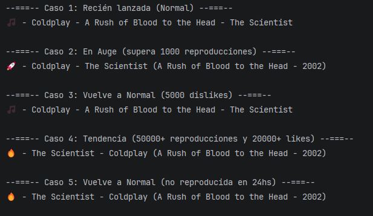

# 🎵 Tendencias Musicales

<p align="center">
  
</p>

## 📖 Descripción

Sistema de gestión de tendencias musicales desarrollado en Java. Modela cómo las canciones cambian de popularidad según sus reproducciones, likes y dislikes.

## ✨ Características

- 🎼 **Tres niveles de popularidad**: Normal, En Auge y Tendencia
- 🎨 **Iconos dinámicos**: 🎵 📱 🔥 según el estado de la canción
- 📊 **Leyendas personalizadas**: Formato diferente para cada popularidad
- ⏰ **Control temporal**: Detección automática si no se escucha en 24 horas
- 👤 **Gestión de artistas y álbumes**: Estructura completa

## 🚀 Uso

```java
// Crear artista y álbum
Artista coldplay = new Artista("Coldplay");
Album album = new Album("A Rush of Blood to the Head", coldplay, 2002);

// Crear canción
Cancion cancion = new Cancion("The Scientist", album);

// Reproducir y ver popularidad
cancion.reproducir();
System.out.println(cancion.detalleCompleto());
// Salida: 🎵 - Coldplay - A Rush of Blood to the Head - The Scientist
```

## 📋 Estados de Popularidad

| Estado | Icono | Condición |
|--------|-------|-----------|
| **Normal** | 🎵 | < 1000 reproducciones |
| **En Auge** | 🚀 | ≥ 1000 reproducciones |
| **Tendencia** | 🔥 | ≥ 50k reproducciones + ≥ 20k likes |

## ⚠️ Reglas de Transición

- Normal → En Auge: superar 1000 reproducciones
- En Auge → Tendencia: superar 50k reproducciones y 20k likes
- En Auge → Normal: acumular 5000+ dislikes
- Tendencia → Normal: sin reproducción en 24 horas

## 📝 Autor

**Francisco Miceli**

### 🎓 Detalles

- **Materia**: Desarrollo en Sistemas
- **Profesor**: Martín Barbieri


